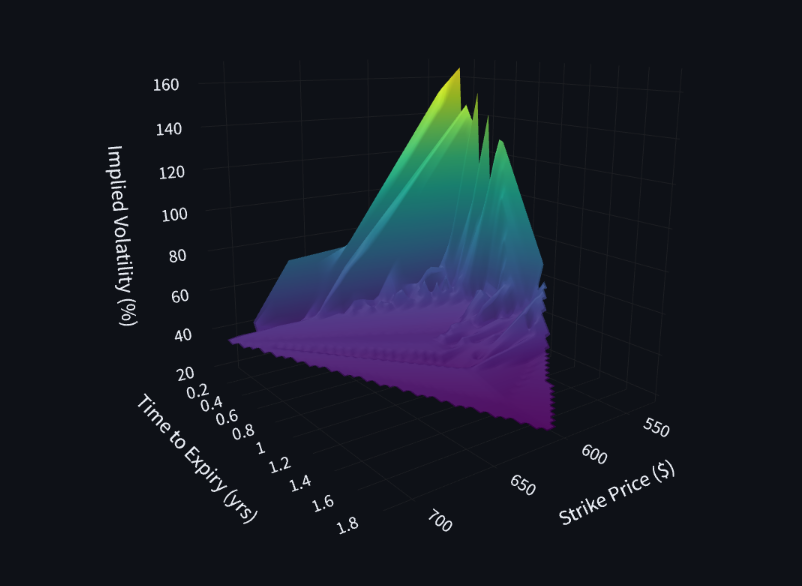

# Implied-Volatility-Surface-
This project will use the Black-Scholes Model to create a 3D surface of Implied Volatility and store values in a database at specific timeframes to further view the shift of IV throughout a set amount of time. 

