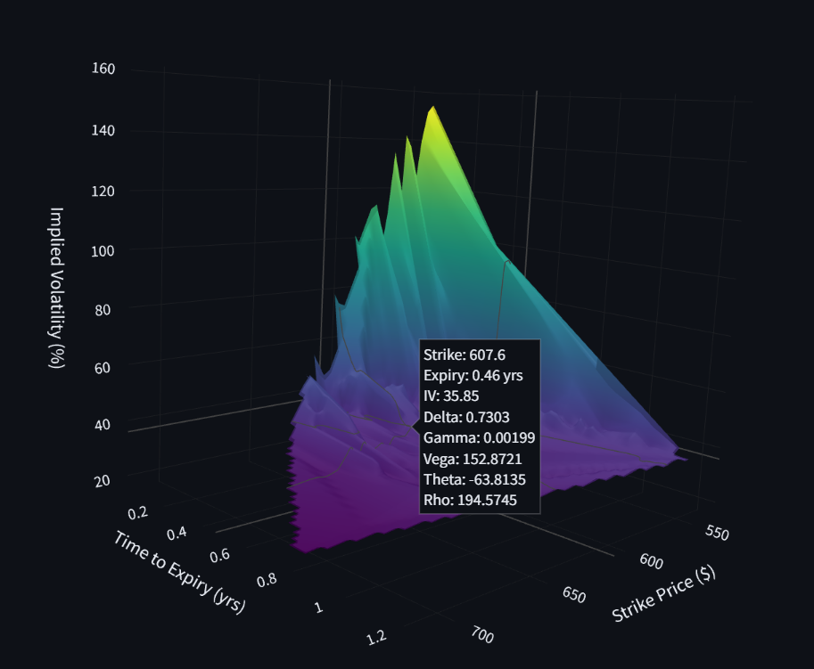

# Implied-Volatility-Surface-
This project will use the Black-Scholes Model to create a 3D surface of Implied Volatility using Brent's Method to calculate the IV values for a range of Strike Prices and Times of Expiration. I used real time market data gathered from yahoo finance and use streamlit and plotly to display everything on a webpage. 

This photo illustrates the IV Surface for a SPY Call Option with a risk free rate of 5 percent and a 2 percent dividend yield with a Min Strike of 535.22 and a Max Strike of 802.84. 

How this is works is by gathering inputted parameters from the streamlit web application into the black_scholes.py file and then plotting the matrix onto the webpage after all calculations take place. 

